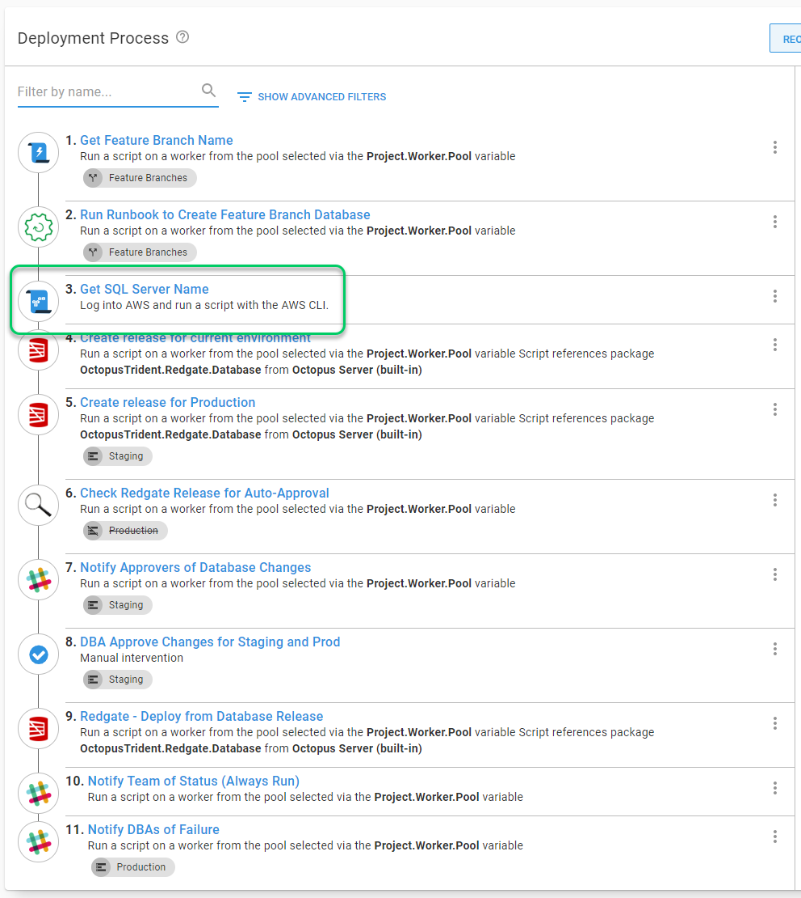
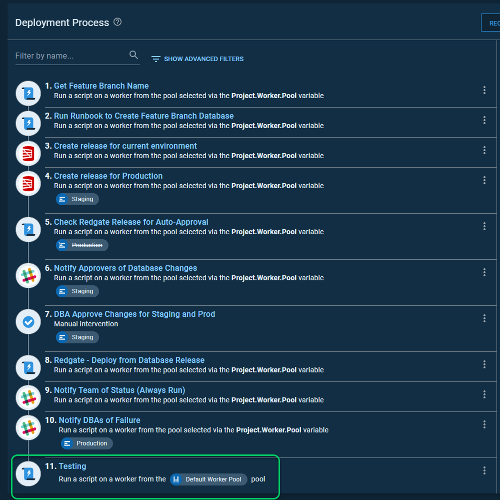
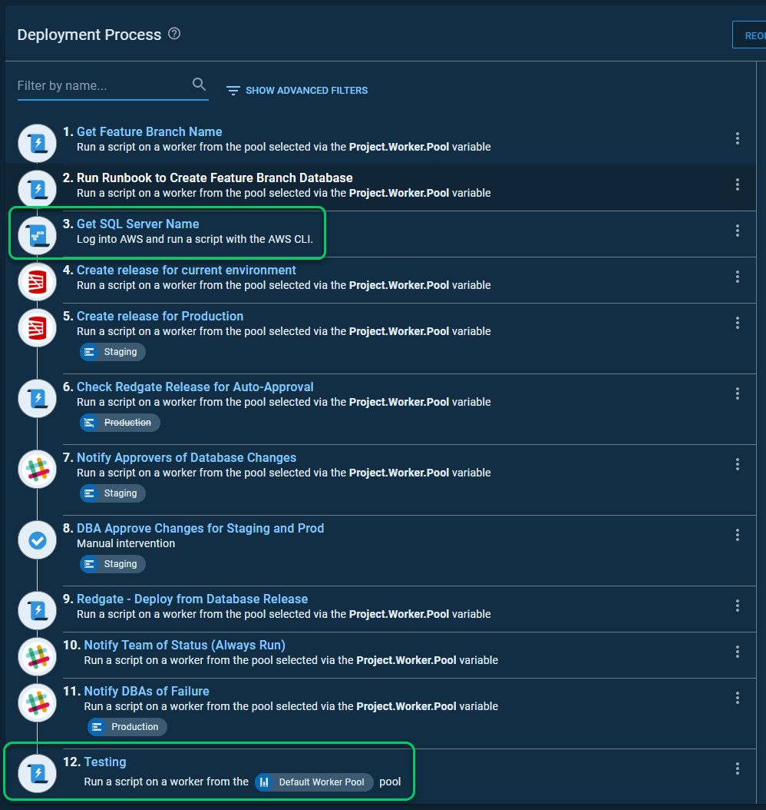

# How it works
You provide the script the name of the source space on an Octopus Deploy instance, the name of a destination space on an Octopus instance.  The script leverages the Octopus Deploy Restful API to copy items from the source space into the destination space.

## What will it clone
The script `CloneSpace.ps1` will clone the following:

- Accounts
- Environments
- External Feeds
- Library Variable Sets
- Lifecycles
- Machine Policies
- Project Groups
- Projects
    - Settings
    - Deployment Process
    - Runbooks
    - Variables
    - Project Versioning Strategy 
    - Project Automatic Release Creation 
- Script Modules
- Step Templates (both community and custom step templates)
- Teams
- Tenants (no tenant variables)
- Tenant Tags
- Targets (no polling tentacles)
- Worker Pools
- Workers (no polling tentacles)

## What won't it clone
The script `CloneSpace.ps1` will not clone the following items:
- Releases
- Deployments
- Roles
- Users
- External Auth Providers
- Tenant Variables
- Server Settings (folders, SMTP, JIRA, etc)
- Packages
- Build Information
- Certificates

This script assumes the user for the destination has `Space manager` rights.  Some of those items, users, roles, and creating spaces, cannot be copied over because the space manager does not have permissions to do so.

Several of those items cannot be copied because the space cloner uses Octopus API.  It doesn't hit the database directly.  Creating a release would create a snapshot, and doing a deployment would do an actual deployment.  Those items would occur when you ran the script, not when they actually occurred on the source space.

Tenant variables were excluded mostly due to how they are returned from the API.  Honestly, it looked like a bit of a maintenance nightmare.

## The Space Has to Exist
The space on the source and destination must exist prior to running the script.  The script will fail if the destination space doesn't exist.  It doesn't create a space for you.

## What the script leaves in place
This script was designed to be run multiple times with the same parameters.  It isn't useful if the script is overwriting/removing values each time you run it.  It will not overwrite the following:

- Community Step Templates (match by name)
- Environments (match by name)
- Feeds (match by name)
- Infrastructure Accounts (match by name)
- Library Variable Set Sensitive variables (match by name)
- Project Items
    - Channels (match by name)
    - Deployment Process steps (match by name)    
    - Library Variable Set Sensitive variables (match by name)        
    - Runbook Process steps (match by name)    
- Worker Pools (match by name)
- Workers (match by name)
- Teams (match by name)
- Targets (match by name)
- Tenants (match by name)

## Limitations
Because this is hitting the Octopus Restful API, it cannot decrypt items from the Octopus Database.  To decrypt items from the Octopus database, you'll need access to the master key and the database.  This script was designed to run on an Octopus Cloud instance.  You, the user, do not have access to that information.  

Please see the [sensitive variables page](SensitiveVariables.md) for more information on the script handles sensitive variables.

## Simple Relationship Management
The process does not attempt to walk a tree of dependencies.  It loads up all the necessary data from the source and destination.  It will attempt to find the corresponding ID in the destination space when it comes across an ID in the source space.  If it cannot find a matching item, it removes that binding.  

If that binding on a specific object is required, the script will fail.  

Let's use environment scoping as an example.  In my source space, I have a variable set called `Global`.  That variable set has an environment scoped to environments.

In my destination space, I only have three of those four environments, `Test`, `Staging`, and `Production`.  As a result, the cloned variable set still has the `Development` value, but it doesn't have a scope associated with it.

## Intelligent Process Cloning
This script assumes that when you clone a deployment process, you want to add missing steps but leave existing steps.

I have a deployment process on my source, where I added a new step.

My destination deployment process has a new step on the end that is not in the source.

After the sync is finished, the new step was added, and the additional step was left as is.

The rules for cloning a deployment process are:

- Clone steps not found in the destination process
- Leave existing steps as is
- The source process is the source of truth for step order.  It will ensure the destination deployment process order matches.  It will then add additional steps found in the deployment process not found in the source to the end of the deployment process.

## Targets and Workers

The script will clone your targets and workers.  However, there are a few key items you should know.

If you are cloning from one instance to another, the tentacle will not trust the destination instances's thumbprint.  You will need to run `Tentacle configure --trust="YOUR SERVER THUMBPRINT"` on the server itself for the tentacle to trust the new server.  See [documentation](https://octopus.com/docs/octopus-rest-api/tentacle.exe-command-line/configure) for more details.

Secondly, the clone script only supports a subset of all targets.  The targets supported are:

- Listening Tentacle
- K8s Cluster (not using a token or cert to auth with)
- Cloud Regions
- Azure Web Apps

The script cannot clone polling tentacles from one instance to another due to how polling tentacles work.  The polling tentacles won't know about the switch.  You will need to set up a new polling tentacle instance on the server. 

## Teams and role scoping

The script provides an option to clone teams.  It follows the following rules:

- Only space-specific teams will be cloned.  Any system teams, such as `Everyone`, `Octopus Administrators`, etc. will _**NOT**_ be cloned. 
- It will assign users who already exist in the destination instance.  It will _**NOT**_ create new users.
- The clone will only create the team.  After that, it will leave the team as is.  
- Teams that are created have the external groups cleared.  
- For team scoping, the roles must exist on both the destination and the source.  This script will _**NOT**_ create new roles.  It only leverages existing roles.  
- If the destination team already has roles scoped to it, the script will skip it.