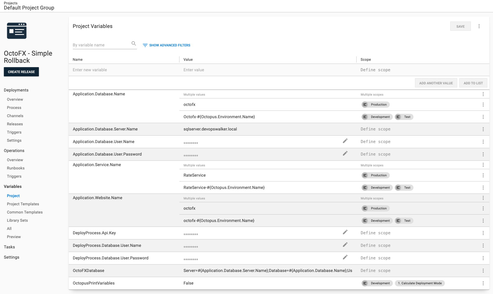
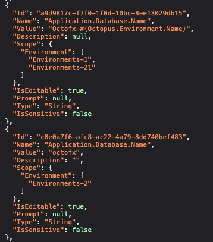
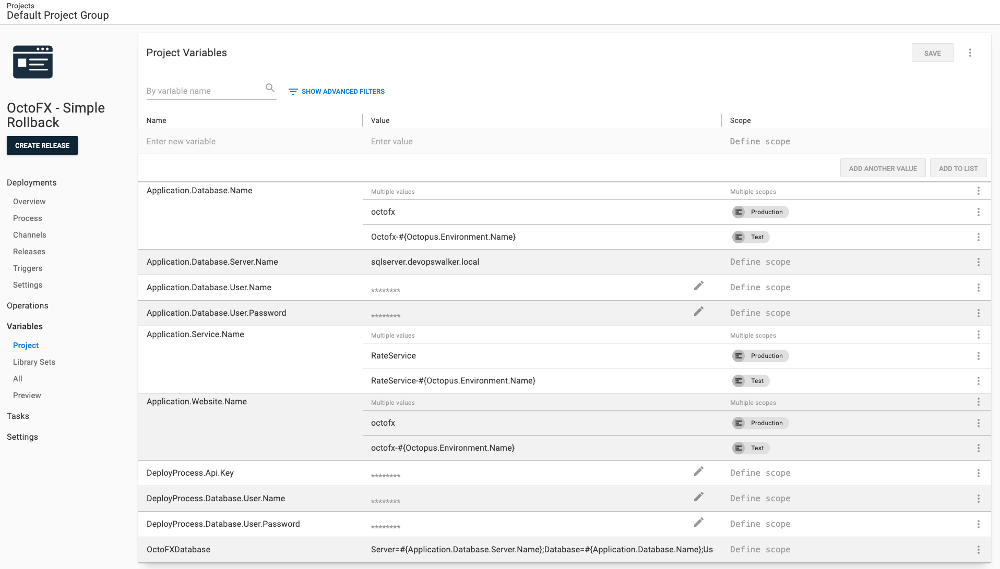
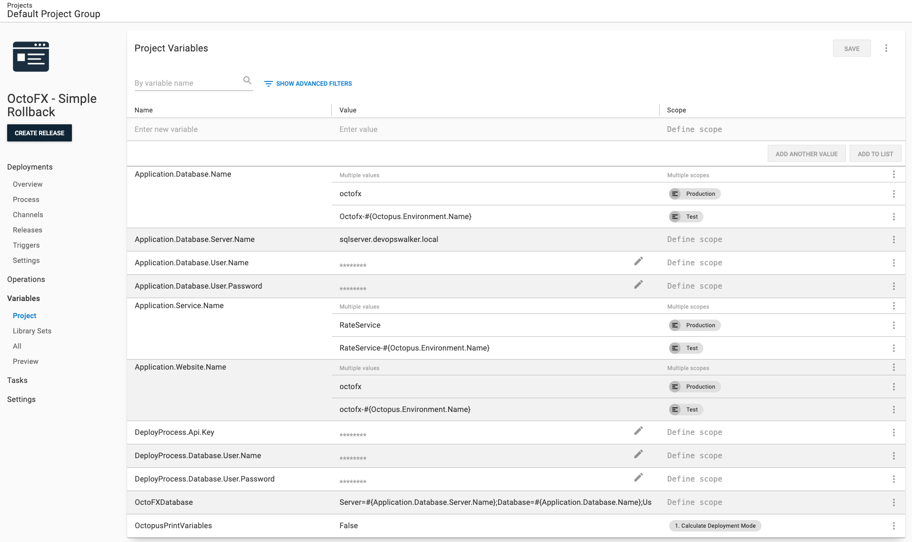

# How Scope Cloning Works

In Octopus Deploy you can scope a number of items such as deployment process steps, variables, or deployment targets to environments, accounts, channels, etc.  Due to a variety of use cases, a significant amount of logic in the space cloner is dedicated to scope cloning.

For this page, we will be using this variable set as an example for how space cloner handles scope cloning.

## How It Works Under the Covers

On the page you can see the variable `Application.Database.Name` has two values, one scoped to `Production` while the other is scoped to `Development` and `Test`.  From a data point of view, Octopus Deploy stores the IDs instead of names in the database.

## Source and Destination Matching

The source and the destination will have different ids.  On the source `Production` == `Environments-2` while on the destination `Production` could equal `Environments-233`, `Environments-900` or some other number.  The space cloner is aware of this and performs the mapping for you.

1. ID `Environments-2` is scoped to a variable
1. Determine the Environment Name associated with that ID using the source Environment list.
1. `Production` is the name associated with that ID.
1. Search the destination Environment list for `Production`
1. `Production` is found, it has the ID of `Environments-550`.

## Missing Destination Data

That matching logic assumes both the source and destination have the environment `Production`.  But what happens when it doesn't?  There are several use cases why an environment, such as `Production` exists on one instance but not the other.  Depending on the item, a missing piece of data on the destination is acceptable, while other items require that data.

### Required Data

The following items require the data to exist on both the scope and destination.  If the data isn't on the destination you'll either get a 400 bad request when attempting to run the cloner OR you'll get unexpected results when you run your deployment or runbook.

- Projects
    - Project Group
    - Default Lifecycle
    - Any Referenced Library Variable Sets
    - Any Referenced Script Modules
    - Deployment / Runbook Process Steps
        - Worker Pool (when defined)
        - Execution Container Feed (when using execution containers)
        - Step Template (when step is a step template)
        - Package Feed (when the step references a package)
    - Channels
        - Referenced Lifecycle
- Target Cloner
    - Machine Policy
    - Worker Pool (when the target needs a worker pool)
    - Account (when the target references a account)
- Teams
    - User Role
- Tenants
    - Variables
        - Project
        - Environment
        - Account
        - Certificate
        - Worker Pool
- Workers
    - Machine Policy

**Please Note**: That required data only applies to items you tell it to clone.  For example, if your project has 30 channels and you tell it to clone 5 then the lifecycles referenced by those 5 channels must exist.  The space cloner doesn't care about the remaining 25.

### Optional Data

The following items will skip any missing data.  This data is optional because nothing bad will happen if the data isn't on the destination.  

- Projects
    - Runbooks
        - Environments
- Lifecycles
    - Phase manual deployment environments
    - Phase automatic deployment environments
- Teams
    - Users
    - User Role
        - Projects
        - Environments
        - Tenants
        - Project Group Ids
- Tenants
    - Project
- Worker Pools
    - At least one worker pool is required

## User Controlled Scope Matching

The space cloner makes a number of decisions for you on what data is required and optional.  However, there exists data where we don't know the right course of action.  In that case, we leave it to you via parameters and command line options.  The options are:

- `ErrorUnlessExactMatch`: An **Error** will be thrown unless an exact match on the scoping is found.  For example, the source has `Development` and `Test`, an error will be thrown unless the destination has `Development` AND `Test`.
- `SkipUnlessExactMatch`: The item (variable, account, step, etc.) will be excluded or skipped unless an exact match is found. For example, the source has `Development` and `Test`, the item will be skipped unless `Development` AND `Test`.
- `ErrorUnlessPartialMatch`: An **Error** will be thrown unless a partial match on the scoping is found.  For example, the source has `Development` and `Test`, an error will be thrown unless the destination has `Development` OR `Test`.
- `SkipUnlessPartialMatch`: The item (variable, account, step, etc.) will be excluded or skipped unless a partial match is found. For example, the source has `Development` and `Test`, the item will be skipped unless `Development` OR `Test`.
- `IgnoreMismatch`: The item will be cloned regardless of matching.
- `IgnoreMismatchOnNewLeaveExistingAlone`: The item will be cloned when it is new and scoping doesn't match.  Otherwise it will leave that already exists alone.

The data is:

- Deployment Process Steps (both runbook and deployment process)
    - Environments: Default is `SkipUnlessPartialMatch`
    - Channels: Default is `SkipUnlessPartialMatch`
- Variables (both project and library variable set)
    - Environments: Default is `SkipUnlessPartialMatch`
    - Channels: Default is `SkipUnlessPartialMatch`
    - Process Owners (deployment process or runbook): Default is `SkipUnlessPartialMatch`
    - Deployment Process Steps: Default is `SkipUnlessPartialMatch`
    - Deployment Targets: Default is `SkipUnlessPartialMatch`
    - Accounts: Default is `SkipUnlessExactMatch`
    - Certificates: Default is `SkipUnlessExactMatch`
- Infrastructure (targets, accounts, and certificates)
    - Environments: Default is `SkipUnlessPartialMatch`
    - Tenants: Default is `SkipUnlessPartialMatch`

### Skip Unless Exact Match Example

Let's go back to our example variable set:

The source has the following environments:

- Development
- Test
- Production

The destination has the following environments:

- Test
- Production

When the variable environment scoping is set to `SkipUnlessExactMatch` the resulting clone will be.  Make note that `Application.Database.Name` only has `Production`.  That is because the other option was scoped to `Development` and `Test`, but the destination didn't have `Development`

### Skip Unless Partial Match Example

Let's re-run that.  But this time we will use `SkipUnlessPartialMatch`.  Again the source is:

The source has the following environments:

- Development
- Test
- Production

The destination has the following environments:

- Test
- Production

The result will be the following.  Make that `OctopusPrintVariables` still does not appear in this scenario.  That is because that step is scoped to `Development`.  There is no `Development`, there has to be at least one item for a partial match to occur.  So the variable was skipped.

### Ignore Mismatch

For the final example, we will use `IgnoreMismatch`.  Of all the items this is the most dangerous and can lead to unpredictable results.  Again the source is:

The source has the following environments:

- Development
- Test
- Production

The destination has the following environments:

- Test
- Production

The result will be the following.  Make that `OctopusPrintVariables` still does now appears, and it is only scoped to the deployment step.  Because `Development` doesn't exist the cloner is unable to create that scope.

Our recommendation is to leave the defaults as is unless there is a compelling reason to change.