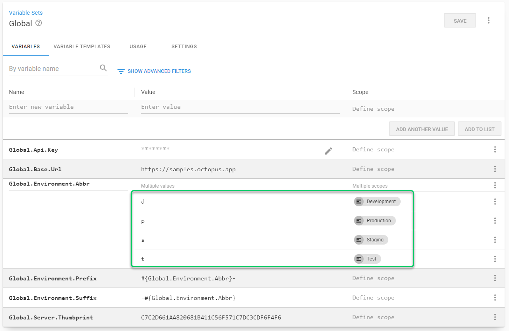
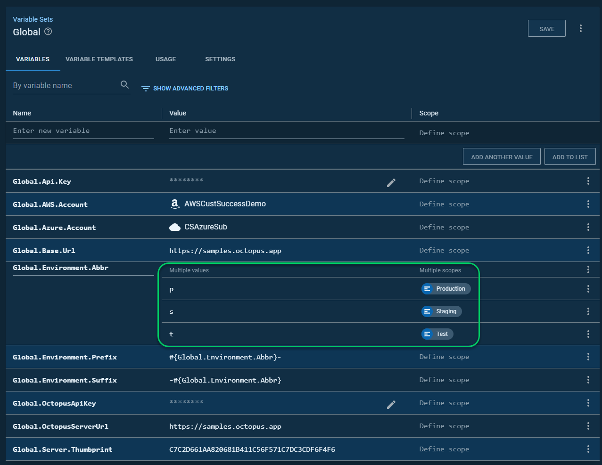

# Parameter Reference

The script accepts the following parameters.

## Source Information
- `SourceOctopusUrl` - the base URL of the source Octopus Server.  For example, https://samples.octopus.app.  This can be the same as the destination.
- `SourceOctopusApiKey` - the API key to access the source Octopus Server.  Recommend using the API key of a [service account](https://octopus.com/docs/security/users-and-teams/service-accounts) user.  That service account user must have read permissions.
- `SourceSpaceName` - the name of the space you wish to copy from.

## Destination Information
- `DestinationOctopusUrl` - the base URL of the destination Octopus Server. For example, https://codeaperture.octopus.app.  This can be the same as the source.
- `DestinationOctopusApiKey` - the API key to access the destination Octopus Server.  Recommend using the API key of a [service account](https://octopus.com/docs/security/users-and-teams/service-accounts) user.  Recommend that the service account has `Space Manager` permissions.
- `DestinationSpaceName` - the name of the space you wish to copy to.

## Items To Clone

All the items to clone parameters allow for the following filters:
- `all` -> special keyword which will clone everything
- Wildcards -> use AWS* to pull in all items starting with AWS
- Specific item names -> pass in specific item names to clone that item and only that item

You can provide a comma-separated list of items.  For example, setting the `VariableSetsToClone` to "AWS*,Global,Notification" will clone all variable sets which start with AWS, along with the global and notification variable sets.  

You must specify items to clone.  By default, nothing is cloned.  If you wish to skip an item, you can exclude it from the parameter list OR set the value to an empty string "".  

- `EnvironmentsToClone` - The list of environments to clone.
- `ExternalFeedsToClone` - The list of external feeds to clone.  
- `InfrastructureAccountsToClone` - The list of accounts feeds to clone.  
- `LibraryVariableSetsToClone` - The list of library variable sets to clone. 
- `LifeCyclesToClone` - The list of lifecycles to clone.  
- `MachinePoliciesToClone` - The list of machine policies to clone.  
- `ProjectGroupsToClone` - The list of project groups to clone.  
- `ProjectsToClone` - The list of projects to clone.  
- `ScriptModulesToClone` - The list of script modules to clone. 
- `SpaceTeamsToClone` - The list of teams specific to the space to clone.  Will not clone system teams.  Version 2019 or higher required. 
- `StepTemplatesToClone` - The list of step templates to clone.  
- `TargetsToClone` - The list of targets to clone.  Please note, this won't clone any polling tentacles.
- `TenantsToClone` - The list of tenants to clone.  Please note, this will not clone tenant variables.
- `TenantTagsToClone` - The list of tenant tags to clone.  
- `WorkerPoolsToClone` - The list of worker pools to clone.  
- `WorkersToClone` - The list of workers to clone.  Please note, this won't clone any polling tentacles.         

## Parent / Child Projects
- `ParentProjectName` - The name of the project to clone.  This has to match exactly one project in the source space.  If this is specified, the regular project cloner process is skipped.
- `ChildProjectsToSync` - The list of projects to sync the deployment process with.   This parameter uses the same wild card matching as the other filters.  Can match to 1 to N number of projects.

## Options

The values for these options are either `True`, `False` or `null`.  Null will cause the default parameter to be used.

- `OverwriteExistingCustomStepTemplates` - Indicates if existing custom step templates (not community step templates) should be overwritten.  Useful when you make a change to a step template, you want to move over to another instance.  Defaults to `false`.
- `OverwriteExistingLifecyclesPhases` - Indicates you want to overwrite the phases on existing lifecycles.  This is useful when you have an updated lifecycle you want to be applied another space/instance.  You will want to leave this to false if the destination lifecycle has different phases.  The default is `false`.
- `OverwriteExistingVariables` - Indicates if all existing variables (except sensitive variables) should be overwritten.  The default is `false`.
- `CloneProjectChannelRules` - Indicates if the project channel rules should be cloned and overwrite existing channel rules.  The default is `false`.
- `CloneProjectRunbooks` - Indicates if project runbooks should be cloned.  This is useful when you just want to copy the project deployment process and the variables, but not the runbooks.  The defaults is `true`.
- `CloneProjectVersioningReleaseCreationSettings` - Indicates if the release versioning strategy and release creation strategy should be cloned.  The default is `false`.
- `CloneTeamUserRoleScoping` - Indicates if the space teams should have their scoping cloned.  Will use the same teams based on parameter `SpaceTeamsToClone`.  The default is`false`.
- `AddAdditionalVariableValuesOnExistingVariableSets` - Indicates a variable on the destination should only have one value.  You would have multiple values if you were scoping variables.  The defaults is `false`.

## AddAdditionalVariableValuesOnExistingVariableSets further detail

On your source space, you have a variable set with the following values:

On your destination space, you have the same variable set with the following values:

When the variable `AddAdditionalVariableValuesOnExistingVariableSets` is set to `True` it will add that missing value.

When the variable `AddAdditionalVariableValuesOnExistingVariableSets` is set to `False` it will not add that missing value.