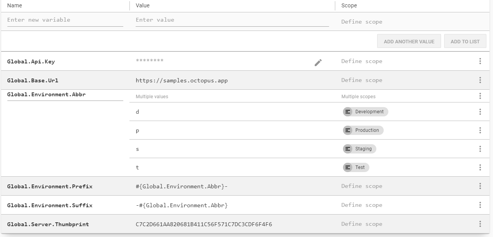
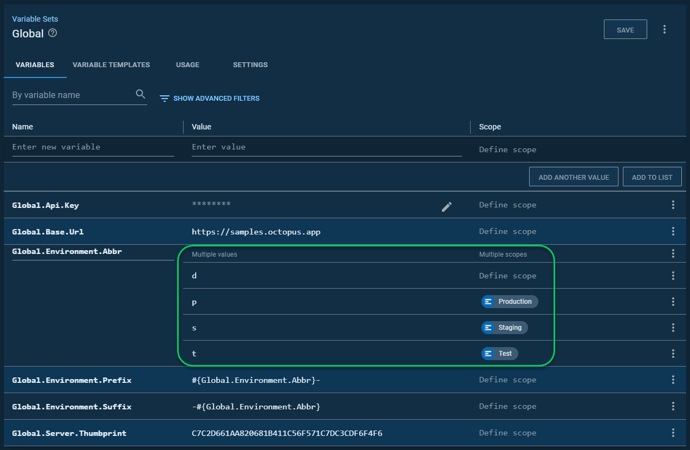

# Use Case: breaking up the default space

The next logical question was, how do I break up my massive `default` space into separate project spaces once spaces came around?  The space cloner was designed with that use case in mind.  However, it wasn't designed to determine all project dependencies (environments, variable sets, lifecycles, etc.).

Please refer to the [how it works page](HowItWorks.md#what-will-it-clone) to get a full list of items cloned and not cloned.

## Gotchas
The process does not attempt to walk a tree of dependencies.  It loads up all the necessary data from the source and destination.  When it comes across an ID in the source space, it will attempt to find the corresponding ID in the destination space using the name.  If it cannot find a matching name, it removes that binding.  

If that binding on a specific object is required, the script will fail.  

Let's use environment scoping as an example.  In my source space, I have a variable set called `Global`.  That variable set has an environment scoped to environments.



In my destination space, I only have three of those four environments, `Test`, `Staging`, and `Production`.  As a result, the cloned variable set still has the `Development` value, but it doesn't have a scope associated with it.



# Example
This example will clone a project from one space (along with its dependencies) to another in the same instance.  It includes only dependencies the project cares about.

Please refer to the [Parameter reference page](ParameterReference.md) for more details on the parameters.

- `OverwriteExistingVariables` - set to `false` to keep the differences preserved.  Any new variable found will be added still.
- `AddAdditionalVariableValuesOnExistingVariableSets` - set to `false` so any new values (specifically around scoping) are not added.  
- `OverwriteExistingCustomStepTemplates` - Set to `false` so the step templates are not updated. 
- `OverwriteExistingLifecyclesPhases` - Set to `false` as the two spaces will have different phases.
- `CloneProjectChannelRules` - set to `true` as you'll want to include the channel rules with the project.
- `CloneTeamUserRoleScoping` - set to `true` as you'll want to include all the scoped permissions with the teams.
- `CloneProjectVersioningReleaseCreationSettings` - set to `true` as you'll want to include the release creation settings.

```PowerShell
CloneSpace.ps1 -SourceOctopusUrl "https://samples.octopus.app" `
    -SourceOctopusApiKey "SOME KEY" `
    -SourceSpaceName "Target - SQL Server" `
    -DestinationOctopusUrl "https://samples.octopus.app" `
    -DestinationOctopusApiKey "My Key" `
    -DestinationSpaceName "Redgate Space" `
    -EnvironmentsToClone "test,staging,production" `
    -WorkerPoolsToClone "AWS*" `
    -ProjectGroupsToClone "all" `
    -TenantTagsToClone "all" `
    -ExternalFeedsToClone "all" `
    -StepTemplatesToClone "all" `
    -ScriptModulesToClone "all" `
    -InfrastructureAccountsToClone "AWS*" `
    -LibraryVariableSetsToClone "AWS*,Global,Notification,SQL Server" `
    -LifeCyclesToClone "AWS*" `
    -ProjectsToClone "Redgate - Feature Branch Example" `
    -TenantsToClone "all" `
    -WorkersToCLone "AWS*" `
    -TargetsToClone "AWS*" `
    -MachinePoliciesToClone "all" `
    -SpaceTeamsToClone "all" `
    -OverwriteExistingVariables "false" `
    -AddAdditionalVariableValuesOnExistingVariableSets "False" `
    -OverwriteExistingCustomStepTemplates "false" `
    -OverwriteExistingLifecyclesPhases "false" `
    -CloneProjectChannelRules "true" `
    -CloneTeamUserRoleScoping "true" `
    -CloneProjectVersioningReleaseCreationSettings "true"
```